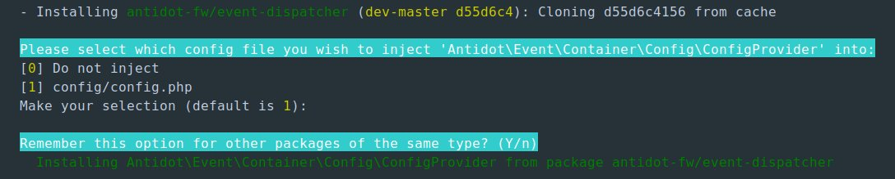

# Antidot event dispatcher

[](https://scrutinizer-ci.com/g/antidot-framework/antidot-event-dispatcher/?branch=master)
[](https://scrutinizer-ci.com/g/antidot-framework/antidot-event-dispatcher/?branch=master)
[](https://infection.github.io)
[](https://shepherd.dev/github/antidot-framework/antidot-event-dispatcher)
[](https://scrutinizer-ci.com/g/antidot-framework/antidot-event-dispatcher/build-status/3.x.x)
[](https://codeclimate.com/github/kpicaza/antidot-event-dispatcher/maintainability)

[Psr 14 Event dispatcher](https://github.com/php-fig/event-dispatcher) implementation.

## Installation

Using [composer](https://getcomposer.org/download/)

````
composer require antidot-fw/event-dispatcher
````

### Using [Laminas config Aggregator](https://docs.laminas.dev/laminas-config-aggregator/)

it install the library automatically



### Using factory:

#### Config

````php
<?php
/** @var \Psr\Container\ContainerInterface $container */
$container->set('config', [
    'app-events' => [
        'event-listeners' => [
//            SomeEvent::class => [
            'some.event' => [
                SomeEventListener::class,
                SomeEventOtherListener::class,
            ]
        ]
    ]
]);
````
#### factory

````php
<?php

use Antidot\Event\Container\EventDispatcherFactory;
use Psr\EventDispatcher\EventDispatcherInterface;

$factory = new EventDispatcherFactory();

$eventDispatcher = $factory->__invoke($container);
$container->set(EventDispatcherInterface::class, $eventDispatcher);
````

#### Async Event Dispatcher Factory


```bash
composer require react/event-loop
```

````php
<?php

use Antidot\Event\Container\AsyncEventDispatcherFactory;
use Psr\EventDispatcher\EventDispatcherInterface;

$factory = new AsyncEventDispatcherFactory();

$eventDispatcher = $factory->__invoke($container);
$container->set(EventDispatcherInterface::class, $eventDispatcher);
````

## Usage

### Send events

```php
<?php

use Psr\EventDispatcher\EventDispatcherInterface;

/** @var \Psr\Container\ContainerInterface $container */
$eventDispatcher = $container->get(EventDispatcherInterface::class);

$eventDispatcher->dispatch(SomeEvent::occur());
```

### Send events Async mode

```php
<?php

use Psr\EventDispatcher\EventDispatcherInterface;
use React\EventLoop\Loop;

/** @var \Psr\Container\ContainerInterface $container */
$eventDispatcher = $container->get(EventDispatcherInterface::class);

$eventDispatcher->dispatch(SomeEvent::occur());

Loop::run()
```
